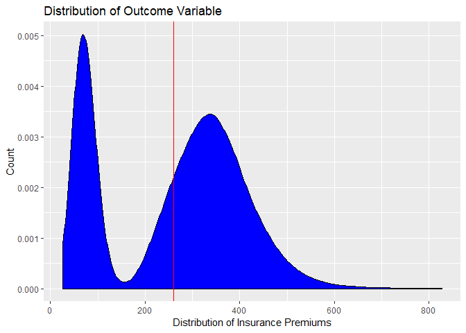

Predictive Modeling with Principal Component Analysis
================

``` r
# Import data
data <- read.csv("KK_Premium_BASE_Kaggle.csv", header=T)
# Examine dimensions of data set
dim(data)
```

    ## [1] 53617   199

``` r
# Plot the distribution of the outcome variable (healthcare insurance premiums)
ggplot(data, aes(Premium)) +    
  geom_density(fill="blue") +   
  geom_vline(xintercept=mean(data$Premium, na.rm=T), color="red") +   
  labs(x="Distribution of Insurance Premiums", y="Count",         
       title="Distribution of Outcome Variable")
```



``` r
# Dummy code factor variables in data set
factor_vars <- c(3,5,6,7)
factor_mat <- c()
for (i in c(factor_vars)) {
  fact <- class.ind(data[,i])
  factor_mat <- cbind(factor_mat, fact)
}
# Replace factor variables in data with dummy coded variables
data <- cbind(factor_mat, data[,c(2,4,8:ncol(data))])

# Fill in missing values using median imputation
for (i in c(1:(ncol(data)-1))) {
  data[is.na(data[,i])==T, i] <- median(data[,i], na.rm=T)
}

# Create train and test set
train_ind <- sample(c(1:nrow(data)), nrow(data)*.8, replace = F)
train <- data[train_ind,]
test <- data[-train_ind,]
```

``` r
# Check to see if there are any constant columns with zero variance
zero_cols <- which(apply(train, 2, function(x) var(x, na.rm=T)) == 0 )
print(zero_cols)
```

    ## named integer(0)

``` r
# Generate the PCA model using the features from the train data set and a variance threshold of 99%
pca_model <- preProcess(train[,c(1:(ncol(train)-1))], method = "pca", thresh = .99)
pca_model
```

    ## Created from 42893 samples and 232 variables
    ## 
    ## Pre-processing:
    ##   - centered (232)
    ##   - ignored (0)
    ##   - principal component signal extraction (232)
    ##   - scaled (232)
    ## 
    ## PCA needed 49 components to capture 99 percent of the variance

``` r
# Generate the principal components for the train and test sets
train_pca_comp <- predict(pca_model, train[,c(1:(ncol(train)-1))])
test_pca_comp <- predict(pca_model, test[,c(1:(ncol(train)-1))])

# Fit a multivariate linear model using the PCA components of the train data set
lin_mod <- train(train_pca_comp, train[,233], method='glm')
lin_mod
```

    ## Generalized Linear Model 
    ## 
    ## 42893 samples
    ##    49 predictor
    ## 
    ## No pre-processing
    ## Resampling: Bootstrapped (25 reps) 
    ## Summary of sample sizes: 42893, 42893, 42893, 42893, 42893, 42893, ... 
    ## Resampling results:
    ## 
    ##   RMSE      Rsquared   MAE    
    ##   38.44737  0.9301552  28.3021

``` r
# Generate predicted outcomes for the test data set
yhat <- predict(lin_mod, newdata=test_pca_comp)

# Calculate the RMSE for the yhat predicted values
rmse_test <- sqrt(mean((test[,233] - yhat)^2))
rmse_test
```

    ## [1] 39.29736
